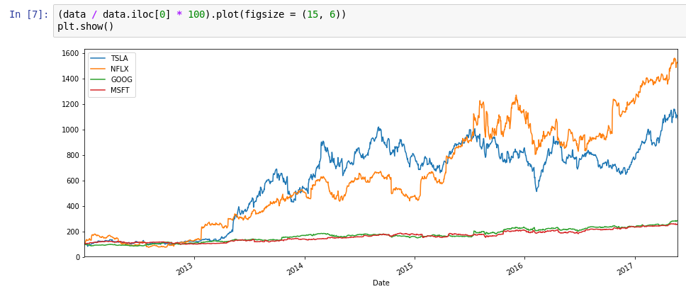

# Python for finance

Notebooks and analisys using Python for studying finance.

## Project structure

### fundamentus
Python library to get financial information fron [Fundamentus](http://www.fundamentus.com.br/)
### matematica-financeira
Jupyter notebooks explaining basic mathematical finance concepts

### python-for-finance-investment-fundamentals-data-analytics
Notebooks I'm writing following the course [Python for Finance Investment fundamentals and data analysis](https://www.udemy.com/python-for-finance-investment-fundamentals-data-analytics/)

## References

- [Udemy - Python for Finance Investment fundamentals and data analysis](https://www.udemy.com/python-for-finance-investment-fundamentals-data-analytics/)
- [Python for Finance](http://www.guidopercu.com.br/blog/python-for-finance/)

## Contact

You can send me a note on twitter [@oumguido](http://www.twitter.com/oumguido)
